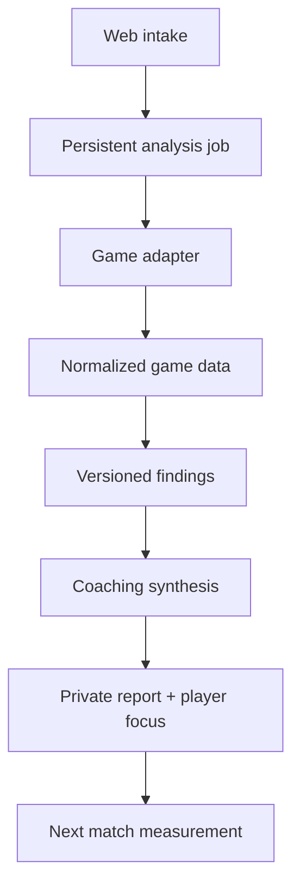

# Replay Method architecture

## Product boundary

Replay Method is one multi-game coaching product. Shared code owns identity, submissions, jobs, reports, player focus, history, feedback, analytics, notifications and operations. Game adapters alone own game-specific ingestion and detection.

## Data layers

The system preserves four separate layers:

1. **Raw input** — original replay, gameplay video/VOD or external match identifier. Binary uploads are private R2 objects, and every request records the source platform and evidence type.
2. **Normalized match** — `game-data.v1`, stored as JSON under `normalized/{game}/{request}/`.
3. **Structured findings** — `finding.v1`, stored relationally with confidence, evidence, metrics, limitations and detector version.
4. **Coaching report** — `coaching.v1`, a concise prioritization of supplied findings. It cannot introduce gameplay facts.

This separation allows parser upgrades, reprocessing, regression testing, cost attribution and evidence audits.

## Persistent entities

| Entity | Purpose |
| --- | --- |
| `players` | One Replay Method identity across all games. Email is a transitional beta identity, not final authentication. |
| `game_accounts` | Per-game provider identity and connection state. |
| `analysis_requests` | User submission and report delivery record. Existing records remain compatible. |
| `analysis_jobs` | Durable stages, attempts, errors, versions, runtime and estimated cost. |
| `matches` | Raw/normalized object references and parser metadata. |
| `analysis_findings` | Evidence-first detector output ordered by coaching priority. |
| `player_focuses` | Current and historical improvement focus for a player/game. |
| `analysis_reviews` | Expert QA labels without making every report manual. |

## Job lifecycle

`queued → validating → ingesting → normalizing → detecting → coaching → persisting → completed`

Terminal product states are `ready`, `blocked` and `failed`. A blocked job preserves the submission and states the missing evidence/access. A retry is claimed idempotently; the unique request/job constraints prevent duplicate primary jobs.

The current Sites worker schedules work with `waitUntil`. The portable target should use a real queue (for example Cloudflare Queues or a container queue) and a retry sweeper. The contract remains the same.

## Trust rules

- A finding must have evidence and an actionable recommendation.
- Confidence is 0–1 plus a human label: high, medium, low or insufficient.
- Insufficient evidence causes abstention, never a forced report.
- The optional LLM receives compact findings, not raw replay/video.
- A report identifies the detector, schema and coaching versions that produced it.
- Manual admin publishing is a quality override, not the target production workflow.

## Portability map

| Current dependency | Portable replacement contract |
| --- | --- |
| ChatGPT Sites / Cloudflare Worker | Any Next-compatible runtime or edge/server deployment |
| D1 | SQLite-compatible database initially; Postgres migration later via repository layer |
| R2 | S3-compatible private object storage |
| `waitUntil` | Durable queue + worker |
| Sites secrets | Host-managed environment variables/secrets |
| SIWC admin identity | OIDC/auth provider with server-side roles |

The domain remains independent at Porkbun and can point to a replacement host.
